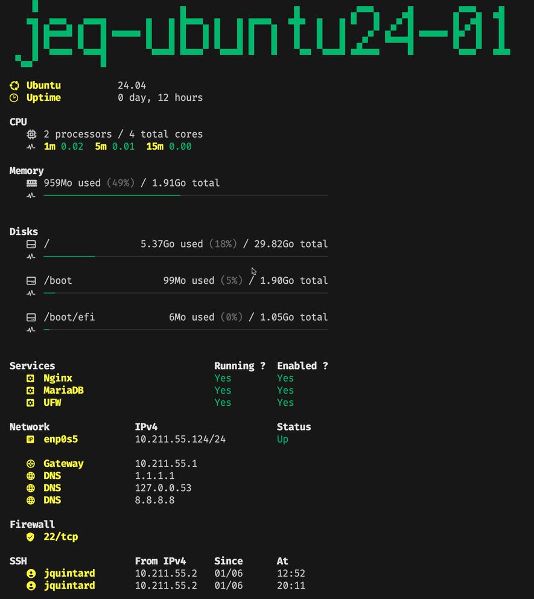
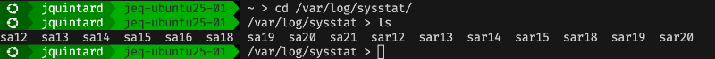

# TUX
Terminal enhancement for Ubuntu.

> **Note:** Successfully tested on **Ubuntu 18** to **25+**.

# TUX.motd

[Awesome MOTD](/src/tux_motd/README.md) for Ubuntu with system information and more.

# TUX.ps1

Nice optional PS1 prompt.

# Prerequisites

TUX uses glyphs (icons) to display some informations. To view these elements properly in your SSH terminal, you need to install a Nerd Font (such as Fira Code, DejaVuSans, etc.) on your local machine. Nerd Fonts are standard fonts that have been patched to include over 10,000 icons from Font Awesome, Material Design, and more.

# Installation

## Automatic
All features will be installed (like the silent flag).

    curl -fs https://raw.githubusercontent.com/YerazLab/TUX/refs/heads/main/install.sh | sudo bash -s -

## Manual
You will be prompted to select the features to install.

    curl -O https://raw.githubusercontent.com/YerazLab/TUX/refs/heads/main/install.sh
    chmod +x ./install.sh
    sudo bash -i ./install.sh

> **Warning:** You need to start the installer as an interactive user (**bash -I**). If you don't, no dialogs will be shown.

## Parameters

| Option | Description |
|-|-|
| `--silent` | Disable all questions and enable all features |
| `--help` | Show the helper and exit |

  
# Update

    cd /opt/TUX/repo
    git pull
    sudo bash -i ./install.sh